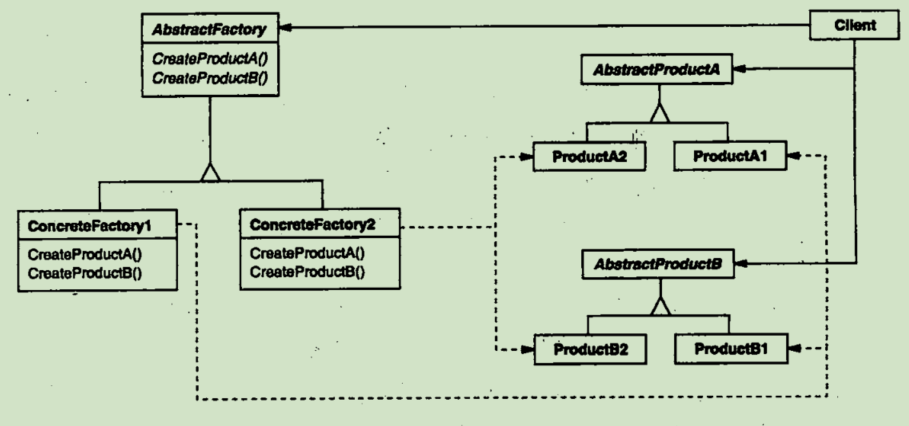

## 抽象工厂

**意图**
提供一个创建一系列相关或相互依赖对象的接口，而无需指定他们具体的类。

**场景**

一个支持多种视感（look-and-feel）标准的用户界面工具包

**适用性**

- 一个系统要独立于他的产品的创建，组合和表示时
- 一个系统要由多个产品系列中的一个来配置时
- 当你要强调一系列相关产品对象的设计以便进行联合使用时
- 当你提供一个产品类库，而只想显示他们的接口而不是实现时
  
**结构**
模式结构图:

**参与者**
- **AbstractFactory**  (WidgetFactory)
---- 声明一个创建抽象产品对象的操作接口

- **ConcreteFactory** （MotifWidgetFactory,PMWidgetFactory）
---- 实现创建具体产品对象的操作

- **AbstractProduct** (Windows,ScrollBar)
---- 为一类产品对象声明一个接口

- **ConcreteProduct** (MotifWindow,MotifScrollBar)
---- 定义一个将被相应的具体工厂创建的产品对象
---- 实现AbstracProduct 接口

- **Client** 
---- 仅使用由AbstractFactory 和AbstractProduct 类声明的接口

**协作**
- 一般在运行的时候创建一个ConcreteFactory 的实例，这个具体的工厂创建具体特定实现的产品对象，为创建不同的产品对象，客户应使用不同的具体工厂
- AbstractFactory 将产品对象的创建委派到它的ConcreteFactory子类。

**效果**
- 分离具体的类
- 它使得已于交换产品系列
- 它有利于产品的一致性
- 难以支持新种类的产品

**实现**
- `将工厂作为单例` 
一般每个产品系列只需要一个ConcreteFactory实例，所以通常最好实现为一个Singleton
- `创建产品` 
AbstractFactory只声明一个创建产品的接口，实际的创建是ConcreteFactory 做的。
一般是为每个产品定义一个 Factory Method,让每个产品系列都要有一个新的具体工厂。
即使产品差异不大，也可以使用 Prototype 模式，工厂可以使用产品的原型实例初始化。
通过复制它的原型来创建新的产品，这要就避免每个产品都需要一个新的具体工厂类。
- `定义可扩展的工厂`
给创建对象的操作增加一个参数，该参数指定了将被创建的对象的种类

**代码示例**

创建一个迷宫和创建一个多样的装饰物

具体见 base 文件夹 go 代码文件

