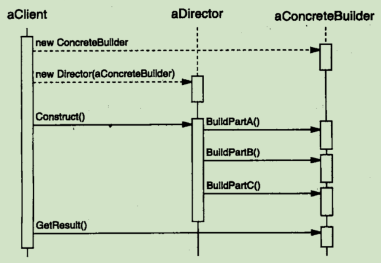

# Builder(生成器)--- 对象创建型模式

## 意图
将一个复杂对象的构建与他的表示分离。使得同样的构建过程可以创建不同的表示

## 动机
一个RTF 文档交换格式的阅读器应能将RTF 转化为多种正文格式，但转化的数目是可能是无限的。
有个解决办法就是将RTF转化成另一种正文表示的TextConvert对象配置这个RTFReader类。当RTFReader对RTF文档
进行语法分析时，它使用TextConverter 去做转换.

TextConvert的子类对不同转换和不同格式进行特殊处理。每种转换器类将创建和装配一个复杂对象的机制隐含在
抽象接口的后面。转换器独立于阅读器，阅读器负责对一个RTF文档进行语法分析.

Builder模式描述了所有这些关系。每个转换器类在该模式中被称为生成器(builder), 而阅读器则称为导向器(director).

## 适用性
- 当复杂对象的算法应该独立于该对象的组成部分以及他们的装配方式时
- 当构建过程必须运行被构建的对象有不同的表示时
  
## 结构
**结构模式**：

**协作**：

- 客户端创建Dirctor 对象，并用它想使用的Builder对象进行配置。
- 产品组件被生成之后，Dirctor 就会通知 Builder
- Builder处理Dirctor 请求，并将组件添加到该产品当中
- 客户端从生成器中检索产品

## 参与者

- **Builder(TextConvert)**
为创建一个Product对象的各个部件指定抽象接口

- **ConcreteBuilder(ASCIIConverter、TeXConverter、TextWidgetConverter)**
实现Builder的接口以构造和装配该产品的各个组件
定义并明确它所创建的表示
提供一个检索产品的接口(**GetASCIITest** 和 **GetTextWidget**)
- **Director (RTFReader)**
构造一个使用Builder 接口的对象
- **Product (ASCIIText、TeXTest、TextWidget)**
表示被构造的复杂对象。ConcreteBuilder创建该产品的内部表示并定义它的装配过程
包含定义组成部件的类，包括将这些组件装配成最终产品的接口

## 效果
1. 它使你可以改变一个产品的内部表示
2. 他将构造代码和表示代码分开
3. 它使你可对构造过程进行更精准的控制

## 实现
1. 有一个抽象的Builder类 为Director 的可能要求的每一个组件定义一个操作。
2. 这些操作可以为缺省的情况什么都不做. 一个ConcereteBuidler 类，对它有兴趣创建的组件重定义这些操作.
3. Builder类接口必须要足够普遍，怎样去构造和装配过程的模型。构造请求的结构只是被添加到产品中，通常这样的模型就已经足够了。
4. 由具体的生成器生成的产品，他们相差之大，无需给不同的产品公共父类。

## 相关模式

Abstract Factory 与Builder 相似，主要区别是 Builder 模式注重于一步步构造一个复杂对象，而